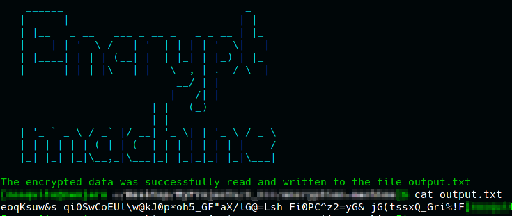
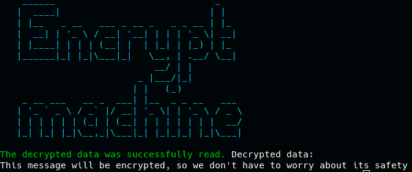
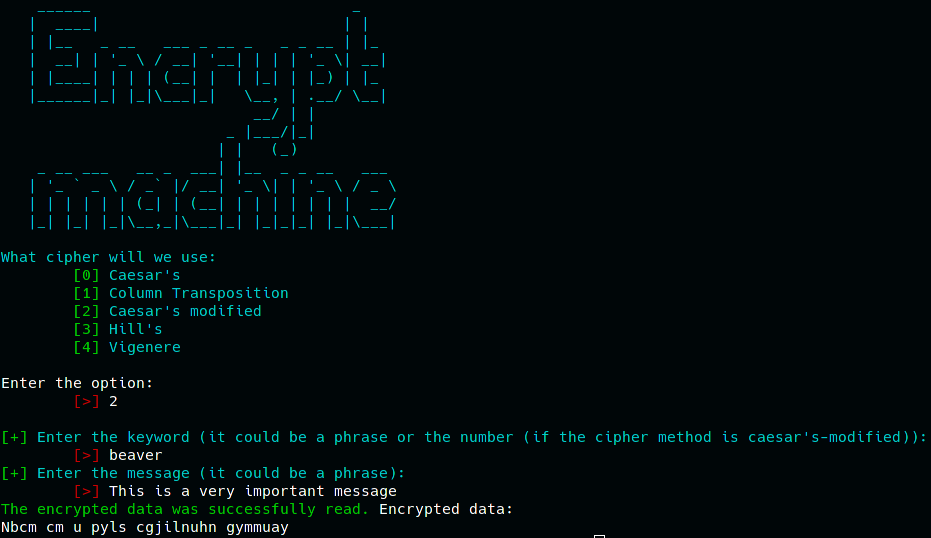
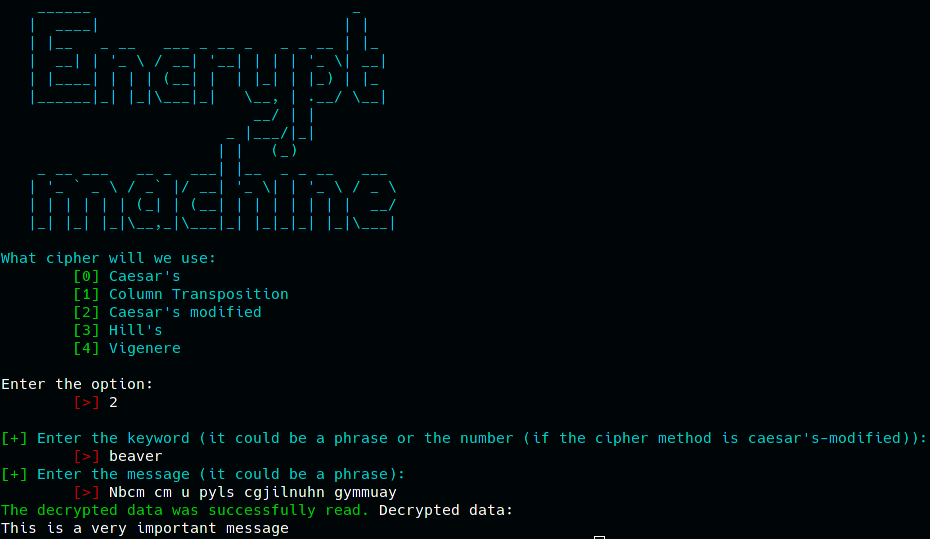
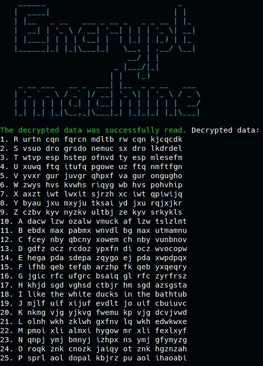

# Contributors  
## [Oleksandr Cherkas](https://github.com/Oleksandr-Cherkas "Yeah, i`m a contributor")
   

# Installation
1. `git clone git@github.com:danillucky1234/encryption-machine.git`  
or  
`git clone https://github.com/danillucky1234/encryption-machine.git`
2. `g++ main.cpp ciphers/caesar/caesar_modified.cpp ciphers/ctc/ctc.cpp ciphers/vigenere/vigenere.cpp ciphers/Hill/Hill.cpp -Wall -std=c++17 -o encryption-machine`
3. `./encryption-machine -h`

## Usage
### Possible options
Option | Meaning
-------|-----------
-h, --help | Show the help message and exit
-m "some text", --message "some text" | Message which will be encrypted
-c "name of the cipher", --cipher "name of the cipher" | Cipher name (method)
-b, --bruteforce | Use brute force for crack caesar-modified cipher (key doesn't required)
-k "some text", --keyword "some text" | Keyword that is required for some ciphers
-ki <path/to/the/file>, --keyword-input <path/to/the/file> | Path to the file, which will used as a keyword
-i <path/to/the/file>, --input <path/to/the/file> | Path to the file which will be encrypted/decrypted
-o <path/to/the/file>, --output <path/to/the/file> | Path to the output file where the encrypted/decrypted message will be saved
-q, --quiet | The qiet output. Important note: this option requires another options. Use `./encryption-machine -h` to see all needs information

## Allowed ciphers
- Caesar's cipher
- Column Transposition Cipher
- Caesar-modified cipher
- Hill's cipher
- Vigenere

## Examples
- `./encryption-machine -c vigenere -k "This is a keyword!" -m "This message will be encrypted, so we don't have to worry about its safety" -o output.txt`

    

### Let's decrypt this message!
- `./encryption-machine -i output.txt -k "This is a keyword!" -c vigenere -d`

    

- If we will try to start program without any option, we will get this message and encrypt it:  
`./encryption-machine`

    

### And sure we want to decrypt this message:
- `./encryption-machine -d`

    

### If we use caesar-modified cipher
- `./encryption-machine -c caesar-modified -m "I like the white ducks in the bathtub" -k 18 -o output.txt -q`  
Output:  
`The encrypted data was successfully read and written to the file output.txt`  
Contents of the output.txt file:  
`Q tqsm bpm epqbm lcksa qv bpm jibpbcj`

### We can brute this cipher:
- `./encryption-machine -c caesar-modified -b -i output.txt`

    

And we can see the right decrypted message in the row 18

## Reporting bugs
If you encounter a bug, do not hesitate to report it in our Issue Tracker. When reporting a problem, please keep the following in mind:
- You are using the latest version of Encryption machine
- Check whether there is a valid solution in our Troubleshooting section.
- Briefly check whether the bug has already been reported. If you find an issue reporting the same bug you encountered, comment there rather than opening a new issue. However, if unsure, please create a new issue.
- State how the bug can be reproduced, i.e. how Encryption machine was invoked when the problem occurred
- Include all error messages and tracebacks in the report
- Even if it seems obvious, describe which behavior you expected instead of what actually happened
- If we have closed an issue apparently inadvertently or inappropriately, please let us know

Good luck